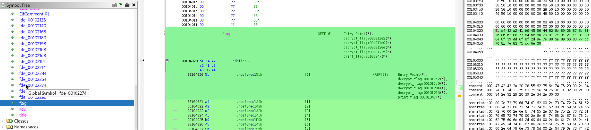

# Need For Speed
Author: Alexander Bushkin.  

#### URL
https://play.picoctf.org/practice/challenge/39  

#### Description
The name of the game is speed. Are you quick enough to solve this problem and keep it above 50 mph?  
need-for-speed  

<br>
<br>
<br>
<br>

## 解答の過程
need-for-speedをクリックするとファイルをダウンロードすることができます。  
ファイル名は「need-for-speed」です。  

Linuxのfileコマンドでファイルの種別を確認するとELFの実行ファイルであることが分かります。  

```
$ file need-for-speed
need-for-speed: ELF 64-bit LSB pie executable, x86-64, version 1 (SYSV), dynamically linked, interpreter /lib64/ld-linux-x86-64.so.2, BuildID[sha1]=2390a6656c057d77b80dba33791724c7d7f75100, for GNU/Linux 3.2.0, not stripped
```

試しに実行してみると、50mph以上を維持するようにとのメッセージが表示され、キーを作成し始めるのですが十分な速さでないとのことで終了してしまいました。  

```
$ ./need-for-speed
Keep this thing over 50 mph!
============================

Creating key...
Not fast enough. BOOM!
```

どのような処理になっているのか、Ghidraで解析してみます。  
まずは、main()を探します。デコンパイルされたコードは以下です。  

```
undefined8 main(void)

{
  header();
  set_timer();
  get_key();
  print_flag();
  return 0;
}
```

header()、set_time()、get_key()と順に呼び出し、最後にprint_flag()を呼び出して終了しています。  

header()を見てみます。デコンパイルされたコードは以下です。  

```
void header(void)

{
  uint local_c;
  
  puts("Keep this thing over 50 mph!");
  for (local_c = 0; local_c < 0x1c; local_c = local_c + 1) {
    putchar(0x3d);
  }
  puts("\n");
  return;
}
```

実行時の初期メッセージを出力するだけのコードでした。  
次のset_timer()を見てみます。デコンパイルされたコードは以下です。  

```
void set_timer(void)

{
  __sighandler_t p_Var1;
  
  p_Var1 = __sysv_signal(0xe,alarm_handler);
  if (p_Var1 == (__sighandler_t)0xffffffffffffffff) {
    puts("\n\nSomething bad happened here. ");
                    /* WARNING: Subroutine does not return */
    exit(0);
  }
  alarm(1);
  return;
}
```

アラームハンドラーをセットし、1秒後にアラームを呼び出すようになっています。  
alarm_handler()を見ると、デコンパイルされたコードは以下です。  

```
void alarm_handler(void)

{
  puts("Not fast enough. BOOM!");
                    /* WARNING: Subroutine does not return */
  exit(0);
}
```

十分に早くないとのメッセージを出力し、終了するようになっています。  
次に、get_key()を見てみます。デコンパイルされたコードは以下です。  

```
void get_key(void)

{
  puts("Creating key...");
  key = calculate_key();
  puts("Finished");
  return;
}
```

キーを作成することを表示し、calculate_key()を呼び出しています。  
calculate_key()を見てみます。デコンパイルされたコードは以下です。  

```
undefined4 calculate_key(void)

{
  undefined4 local_c;
  
  local_c = -0x377825fe;
  do {
    local_c = local_c + -1;
  } while (local_c != -0x1bbc12ff);
  return 0xe443ed01;
}
```

local_cに-0x377825feを初期値として、do-whileループでデクリメントしています。ループを抜ける条件が-0x1bbc12ffになることなので、条件を満たさないか、もしくは長い時間を要することになります。  
なお、戻り値が0xe443ed01であり、これがキーになることが分かります。  

最後に、print_flag()を見てみます。デコンパイルされたコードは以下です。  

```
void print_flag(void)

{
  puts("Printing flag:");
  decrypt_flag(key);
  puts(flag);
  return;
}
```

keyを引数にして、decrypt_flag()を呼び出しています。  
decrypt_flag()を見てみます。デコンパイルされたコードは以下です。  

```
void decrypt_flag(int param_1)

{
  int local_1c [4];
  uint local_c;
  
  local_1c[0] = param_1;
  for (local_c = 0; local_c < 0x37; local_c = local_c + 1) {
    flag[(int)local_c] = flag[(int)local_c] ^ *(byte *)((long)local_1c + (long)((int)local_c % 2));
    if ((int)local_c % 3 == 2) {
      local_1c[0] = local_1c[0] + 1;
    }
  }
  return;
}
```

param_1がkeyになり、local_1cにセットして配列として扱うようになっています。  
そして、forループでflagの要素数分回しながら、flagの配列データとparam_1の配列データを操作しながら、最終的なflagとしてセットしています。  
key（local_1c）は、ループカウンターを3で割ったときの余りが2になったときにインクリメントされています。  

### どう解くか
以上より、このコードの動きが把握できました。  
フラグを取得する方法として、次のような内容が考えられます。  
- keyを与えてdecrypt_flag()を直接呼び出す。
- calculate_key()のループを省いて処理を進められるようにする。
- decrypt_flag()を実装する。

ここでは、decrypt_flag()を実装して、フラグを取得する方法を採用してみます。  

### Pythonで実装
まず、flagのデータを取得します。  
GhidraのSymbol TreeのLabelsからflagを選択し、バイナリーウインドウを表示されることで値を取得できます。  

  

以下がflagデータです。  

```
51 a4 42 a2 41 b9 45 96 44 82 6b 89 25 87 6a 8f 26 86 62 88 77 84 66 8a 29 8f 7c 9e 2a ce 3a 89 6e 8f 39 dd 6f 8f 2d 9e 7e 88 6a 89 66 83 77 cd 70 81 7e 83 75 cc 6e 00
```

デコンパイルされたコードを、動きを意識ながらPythonでスクリプト化したのが以下のコードになります。  
ファイル名をsolver.pyとしました。  

```
param_1 = 0xe443ed01
flag = [0x51, 0xa4, 0x42, 0xa2, 0x41, 0xb9, 0x45, 0x96, 0x44, 0x82, 0x6b, 0x89, 0x25, 0x87, 0x6a, 0x8f, 0x26, 0x86, 0x62, 0x88, 0x77, 0x84, 0x66, 0x8a, 0x29, 0x8f, 0x7c, 0x9e, 0x2a, 0xce, 0x3a, 0x89, 0x6e, 0x8f, 0x39, 0xdd, 0x6f, 0x8f, 0x2d, 0x9e, 0x7e, 0x88, 0x6a, 0x89, 0x66, 0x83, 0x77, 0xcd, 0x70, 0x81, 0x7e, 0x83, 0x75, 0xcc, 0x6e, 0x00]

local_1c = [0] * 4
local_1c[0] = param_1

for local_c in range(0x37):
    # local_1c[0] を little-endian 4バイトに変換
    key_bytes = local_1c[0].to_bytes(4, byteorder="little", signed=False)

    flag[local_c] = flag[local_c] ^ key_bytes[local_c % 2]

    if local_c % 3 == 2:
        local_1c[0] = local_1c[0] + 1

decrypted_flag = ''.join(chr(b) for b in flag)
print(decrypted_flag)
```

これを実行することで、以下のフラグを取得できます。  

```
$ python3 solver.py
PICOCTF{Good job keeping bus #1deb50bb speeding along!}
```

<br>
<br>
<br>
<br>

## フラグ
PICOCTF{Good job keeping bus #1deb50bb speeding along!}  

※picoCTF{ }ではなく、PICOCTF{ }です。  

